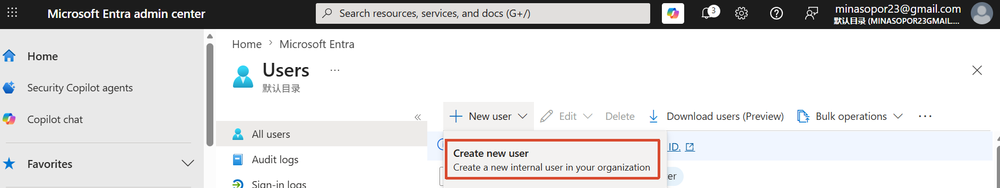
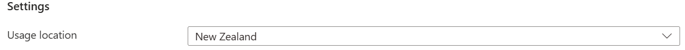
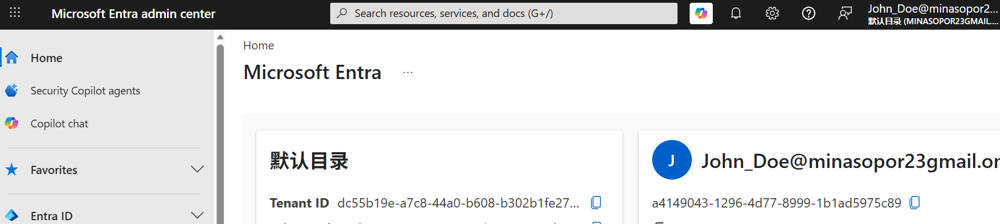
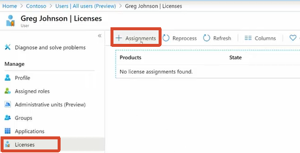
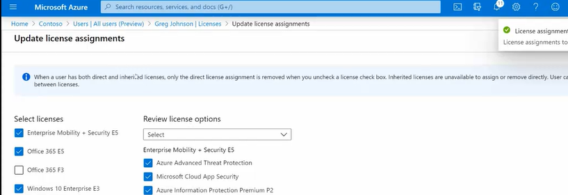
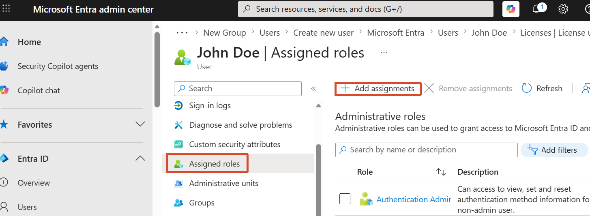
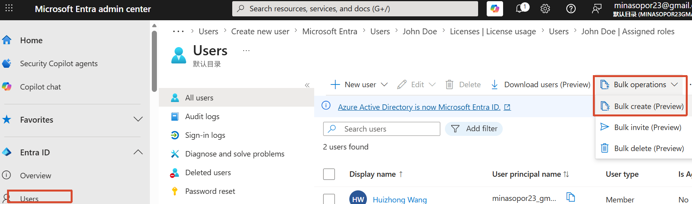
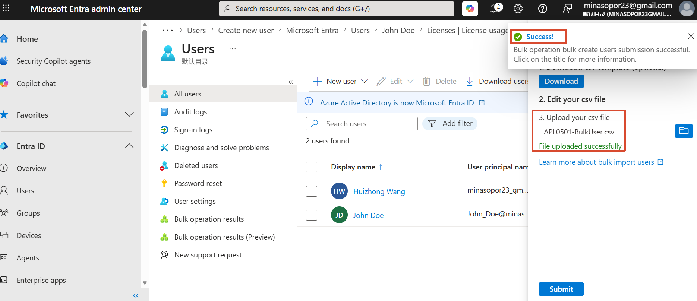

[toc]

# Obejective

- Create User
- Assign licenses
- Assign a role to a user
- Bulk import users

# 1. Create a user

- Entra Admin Center → Users → New User

  

  > [!NOTE]
  >
  > Prevented license assignment failures in M365 by ensuring **Usage Location** is configured for all new user objects

  

- Log in to confirm user

  

# 2. Assign licenses

- Select a user → Lisenses → Assignments

  

  

- Bulk users 

  Using powershell

# 3. Assign a role to a user

- Select a user → Assigned roles → Add assignments

  

# 4. Bulk import users

- Users → Bulk operations → Bulk create → Download the csv template

  

- Upload the csv file

  

