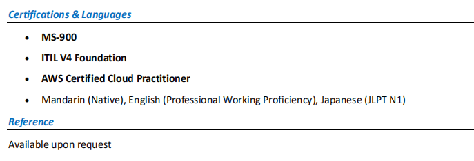

[toc]

## Obejective

- 创建用户
- 创建组
- 分配权限

## 1. Create User

路径：

> Entra Admin Center → Users → New User

创建：

- user1: john.doe
- user2: jane.smith

------

## 2. Create Group

- IT-Support
- Sales
- HR

## 3. Assign user to group

