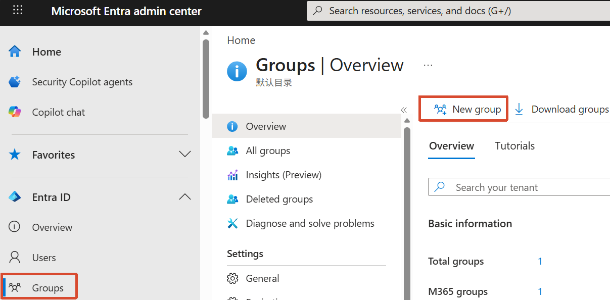
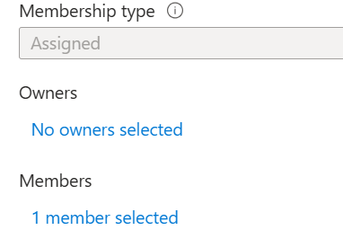
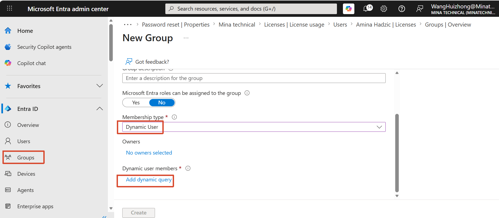
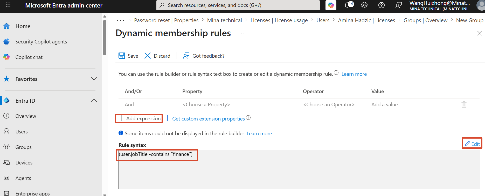
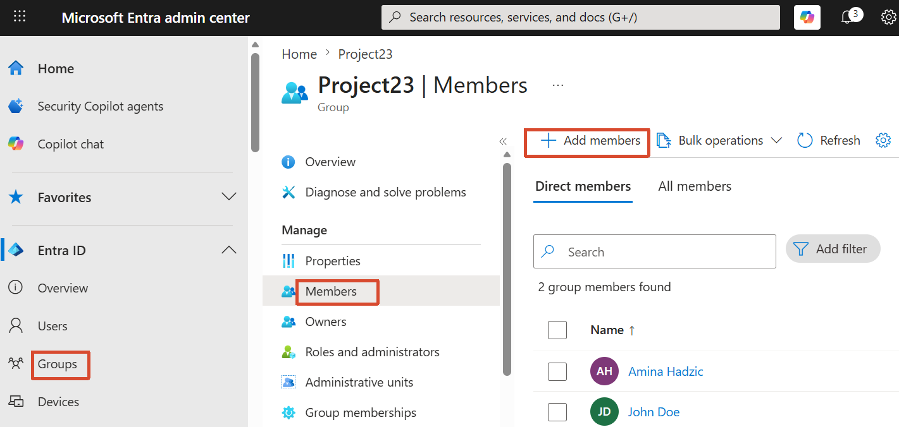
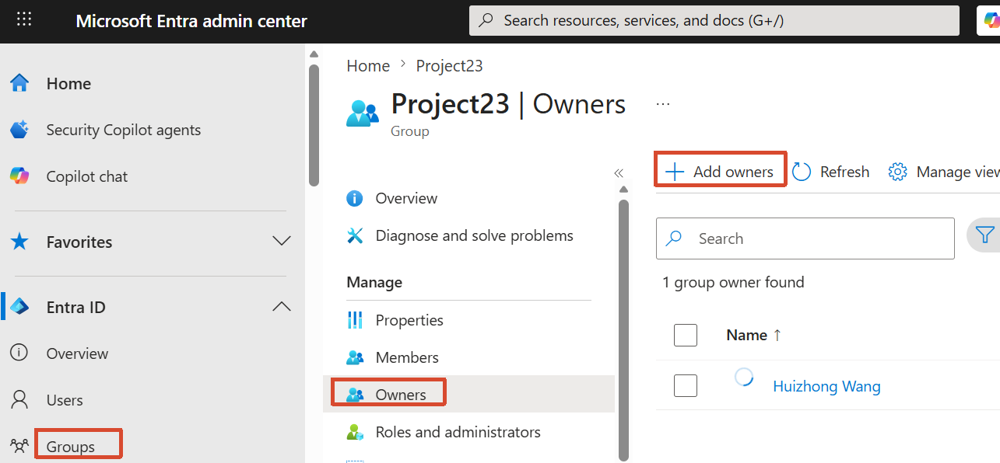
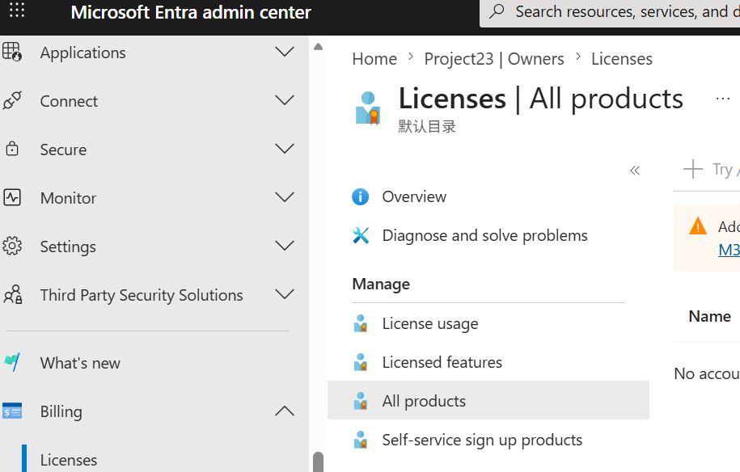

[toc]

# Obejective

- Create a M365 group
  - Assigned members
  - Dynamic members
- Assign members to a group
- Add licenses and owners to a group

# 1. Create a M365 group

- Groups → New group

  

- Add members

  - Assigned members

    

  - Dynamic members

    

    Add expression Or Edit rule syntax：
    
    

# 2. Assign members to a group

- Groups → All groups → Select a group → Members → Add members

  

# 3. Add licenses and owners to a group

- Groups → All groups → Select a group → Owners → Add owners

  

- Billings → Lisenses → All products → Select a license and select a group

  
