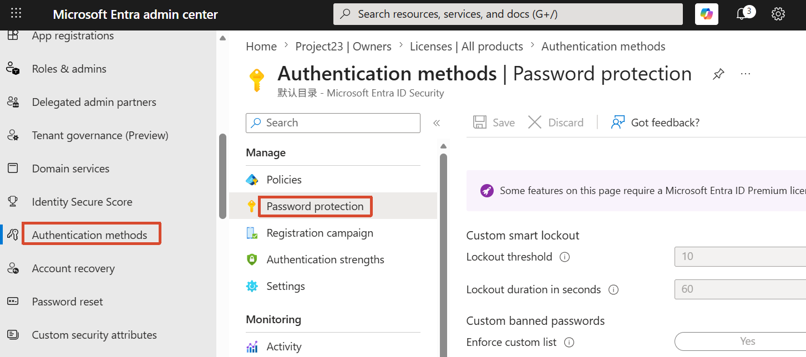
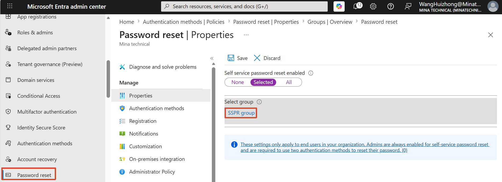
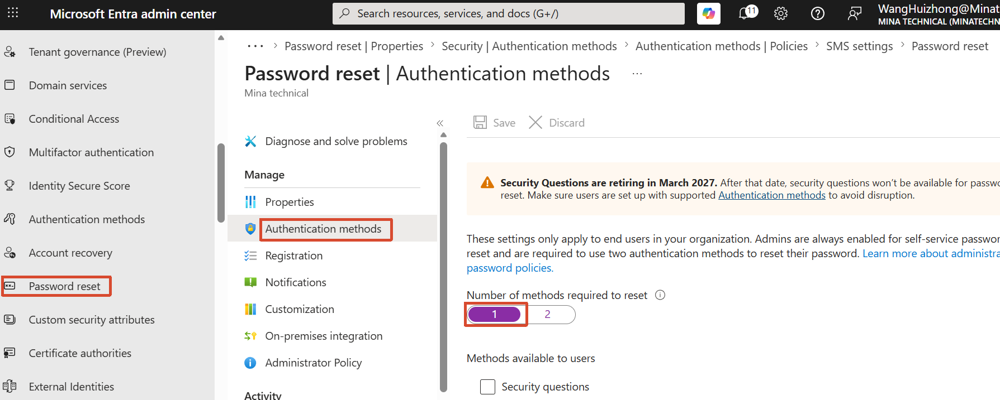
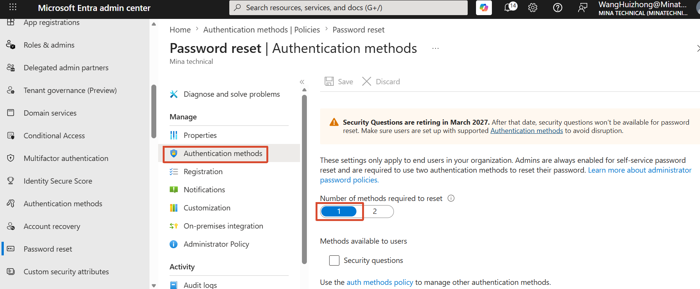
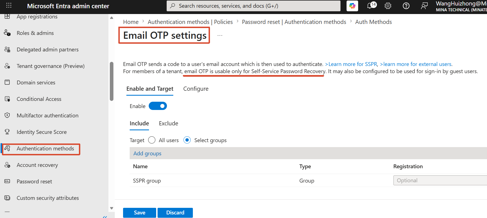
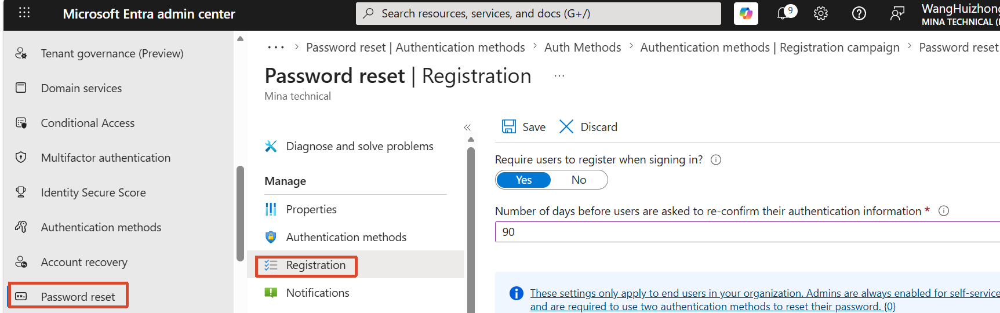
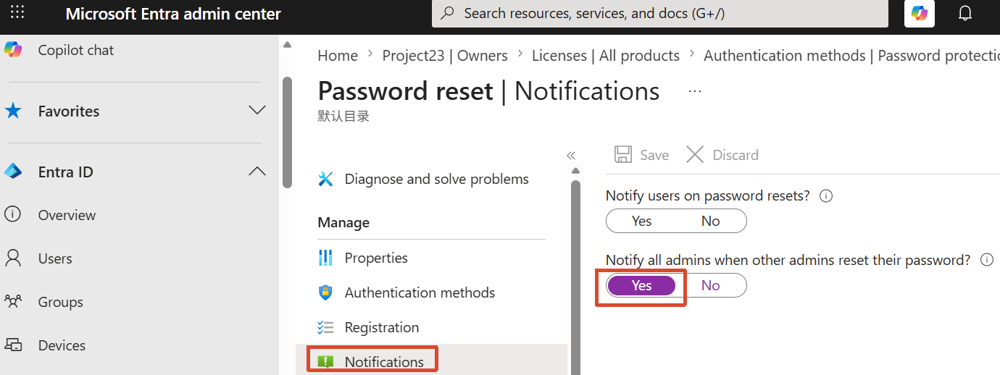

[toc]

# Obejective

- Password protection
- Self-Service Password Rest (SSPR)

# 1. Password protection

- Authentication methods → Password protection

  

# 2. Self-Service Password Rest (SSPR)

- Password reset → Properties:  select All and then save  

  

  Password reset → Authentication methods

  

- Authentication methods

  

  Auth Methods：

  

- SSPR registration

  

- SSPR reset notifications:

  Password reset → Notifications

  
