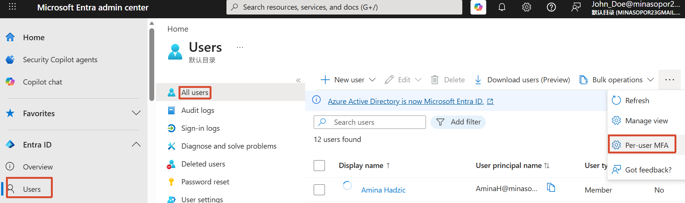
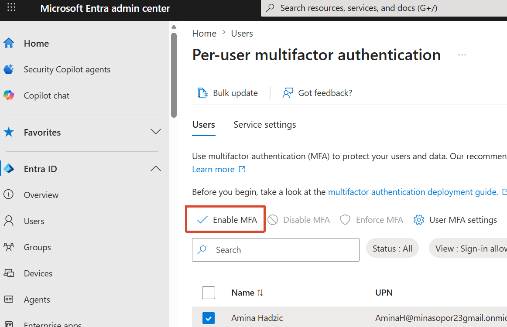
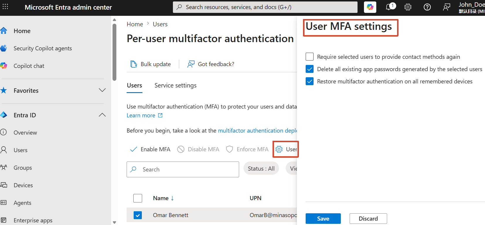
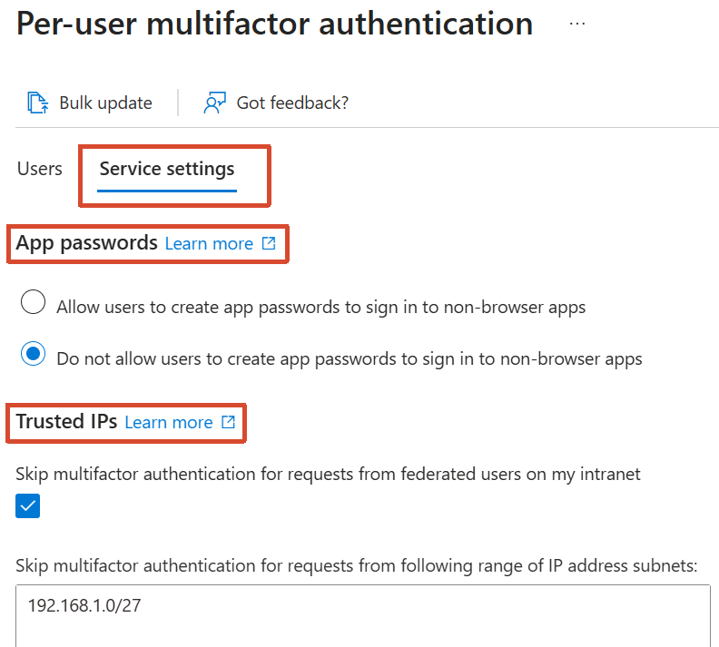
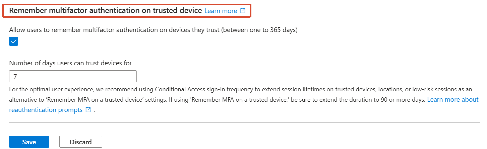
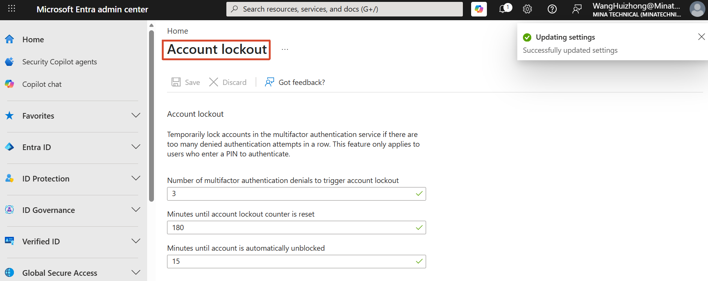
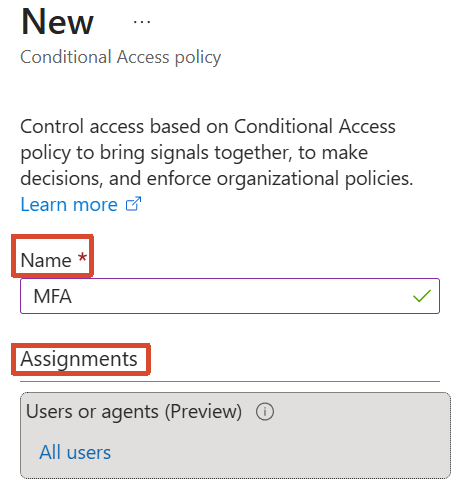
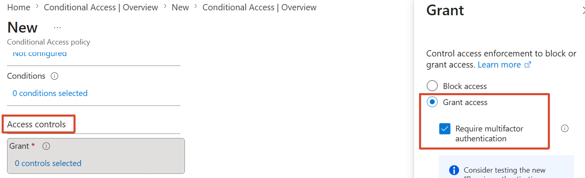

[toc]

# Obejective

- Enable / Disable Per-user MFA settings
- Service settings
- MFA account lockout settings
- Multiple users MFA settings

# 1. Enable / Disable Per-user MFA settings

- Users → All users → Per-user MFA → Users

  

  

  

# 2. Service settings

- Users → All users → Per-user MFA → Service settings

# 3. MFA account lockout settings

# 4. Multiple users MFA settings

- Conditional access → Create new policies 

  

  
