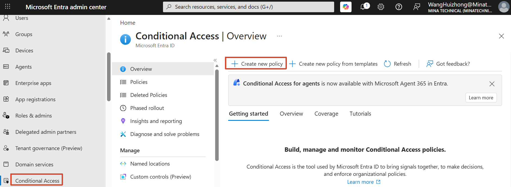
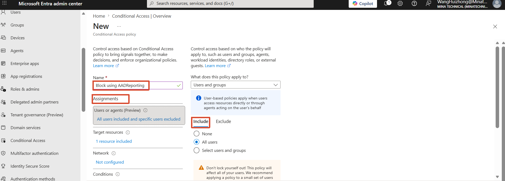
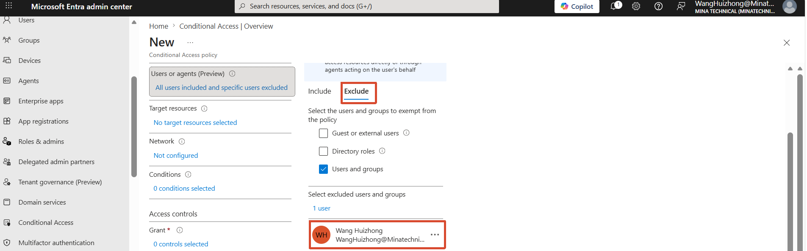
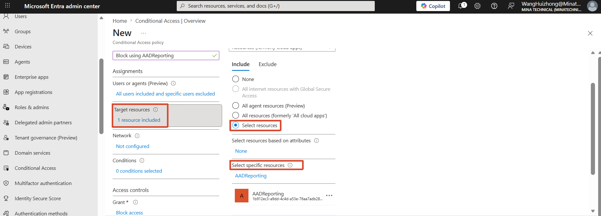
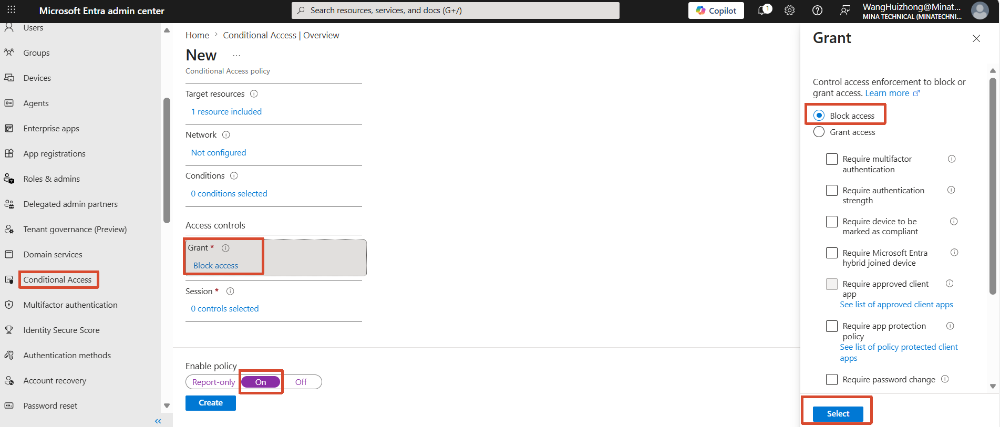
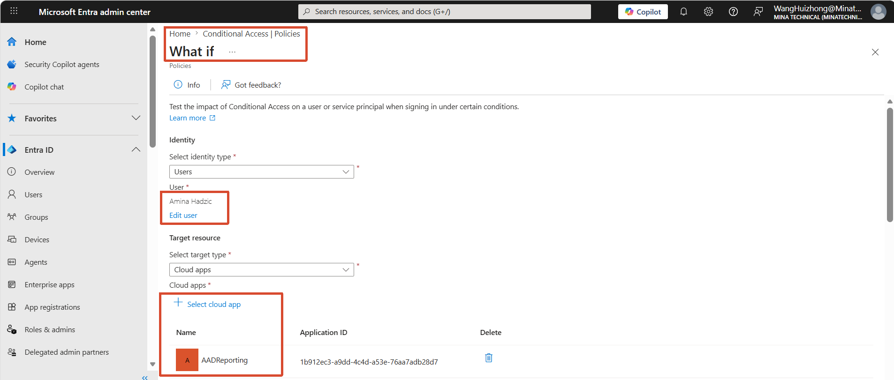
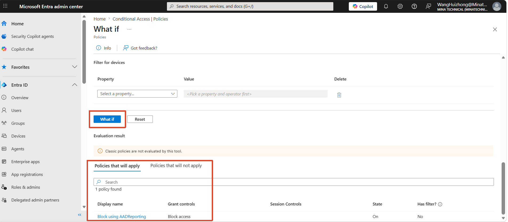

[toc]

# Obejective

- Create a Conditional Access policy

- Perform a What If analysis for a conditional access policy

# 1. Create a Conditional Access policy

Create a Conditional Access policy to block using a specific app.

1. Create new policy：

   

2. Assignment：

   

   

3. Target resource

   

4. Grant → Block access → Select

   

# 2. Perform a What If analysis for a conditional access policy

- Conditional access → Policies → What if

  

- We can see the Blocking policy is applied:

  
