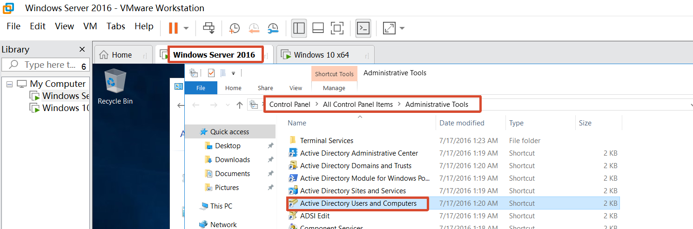
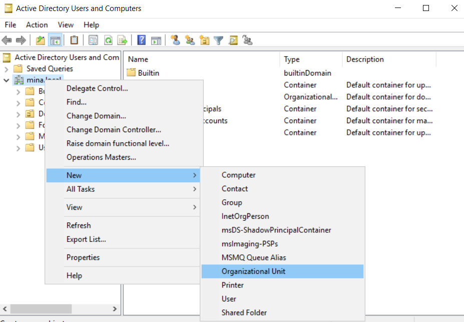
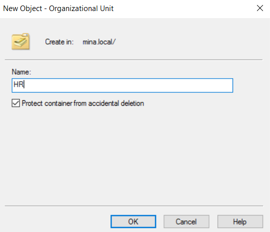
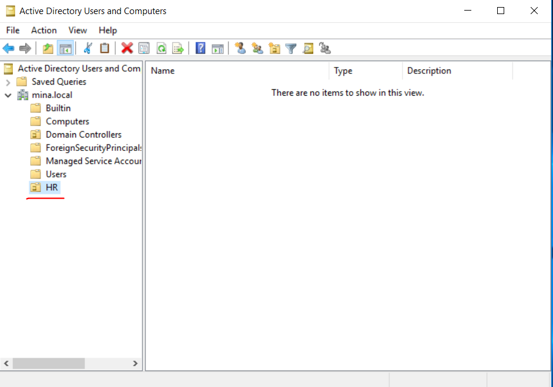
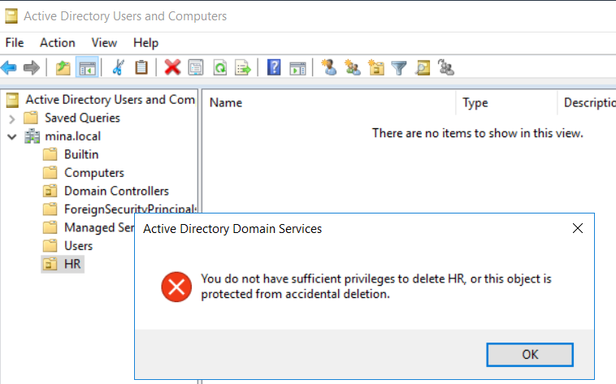
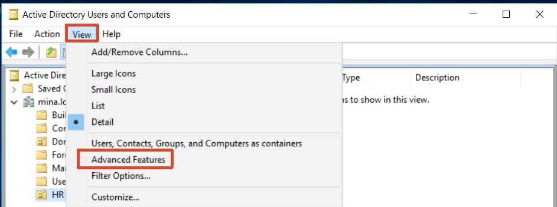
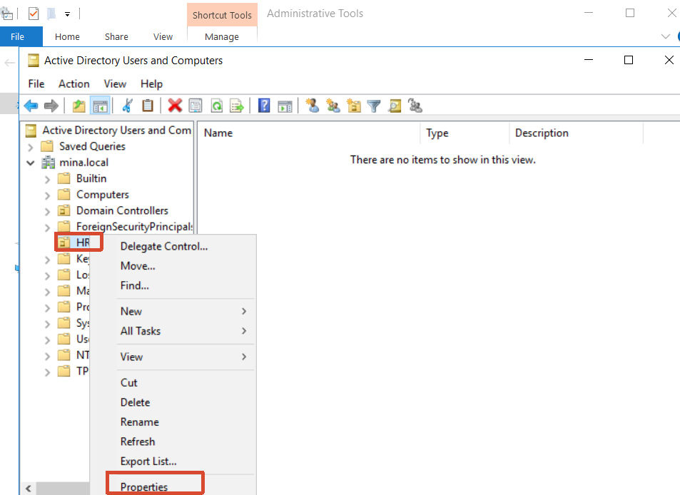
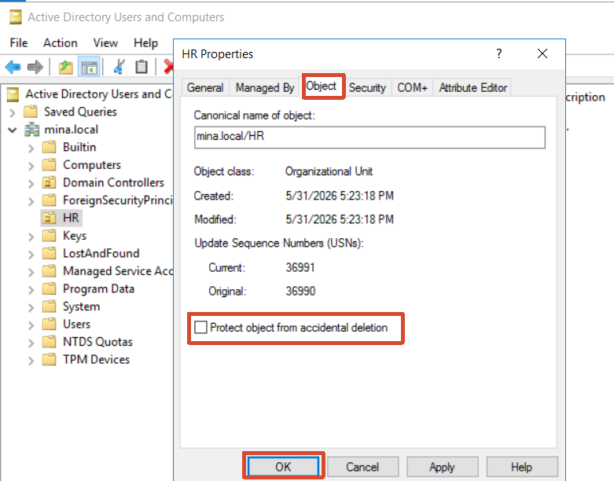

[toc]

# Obejective

- Create organization
- Delete organization

# 1. Create organization

- Windows server -> Control panel -> Administrative tools -> Active Directory Users and Computers

  

- New -> Organization Unit

  

  

# 2. Delete organization

- If we delete directly, it will pop up a warning

  

- View -> Advanced features，choose the file you want to delete and click properties. Uncheck the item below: then you can delete the file 

  

  

  
