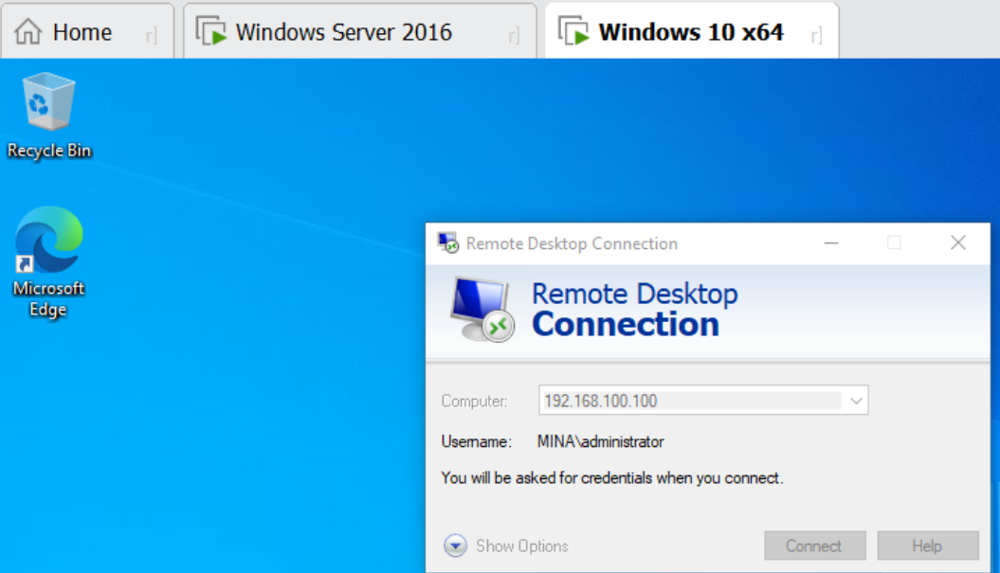
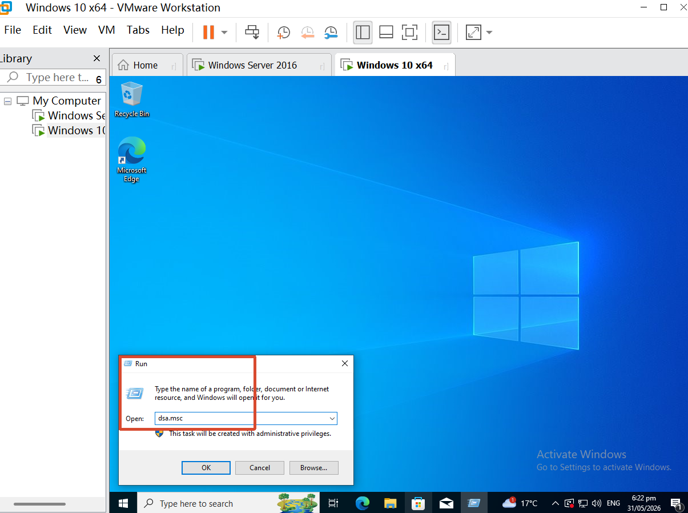
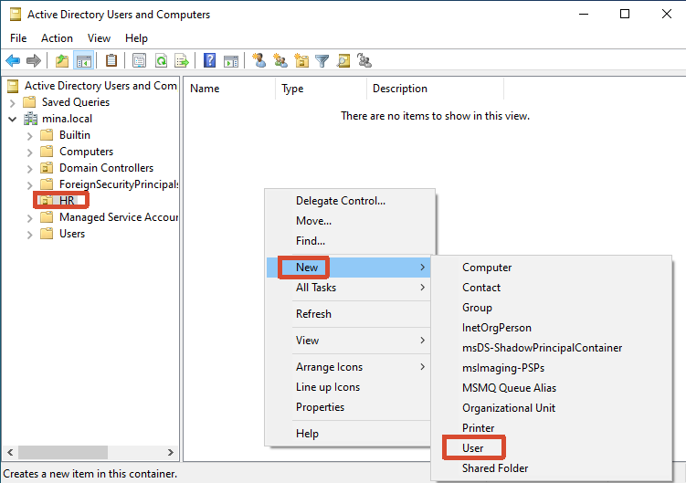
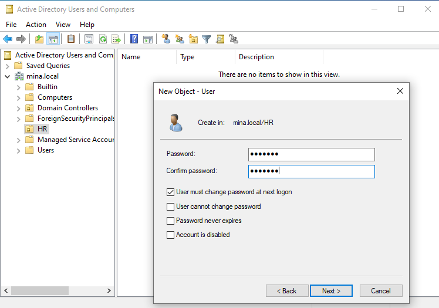
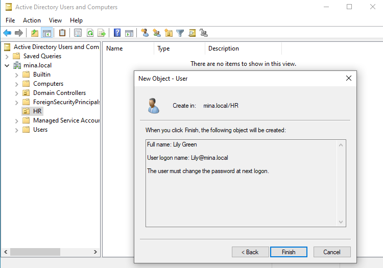
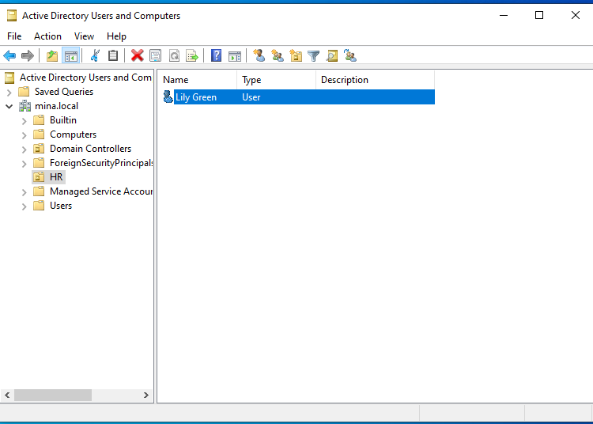
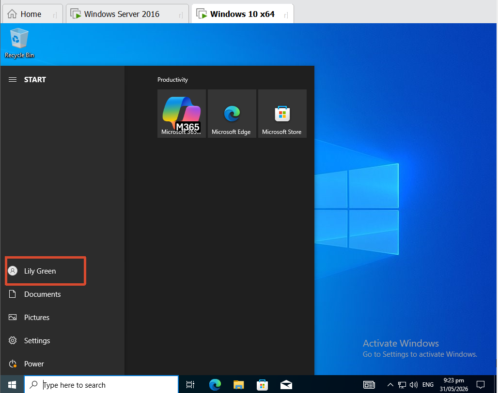

[toc]

# Obejective

- Connect to the server
- Create a user
- Log in 

# 1. Connect to the server

- Method①: Remote desktop connection（ not recommend, need authentication）

  

- Method②: Run -> **dsa.msc**

  

# 2. Create a user

- Choose a department -> New -> User

  

  

  

  

  

# 3. Log in 

