[toc]

# 1. Scenario

The user locked out the account by tried the wrong password many times：

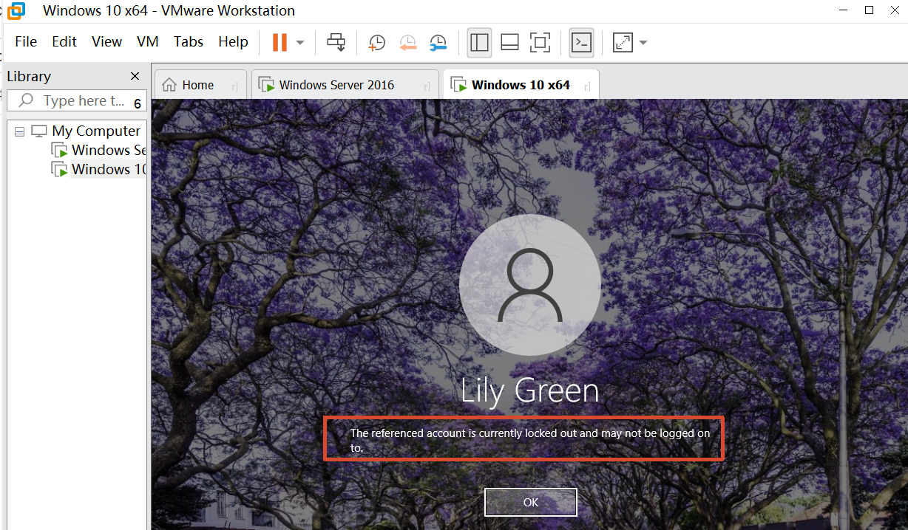

# 2. Action taken

## 2.1 Find the user

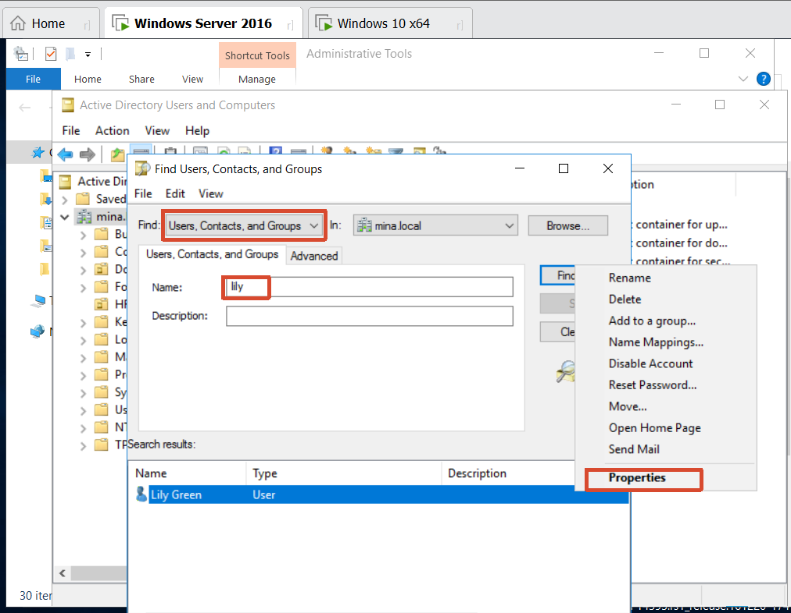

## 2.2 Unlock the account

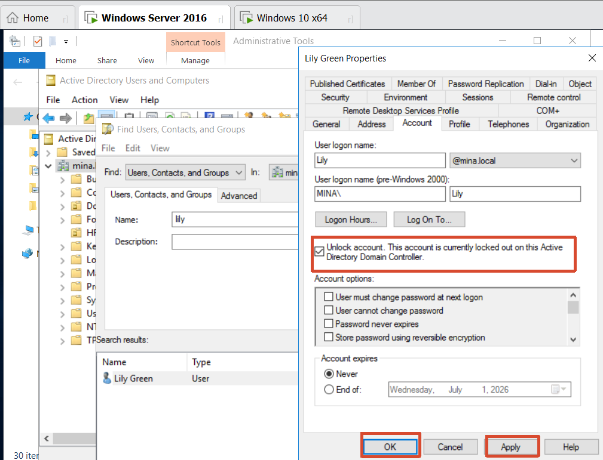

Now the account is unlocked：

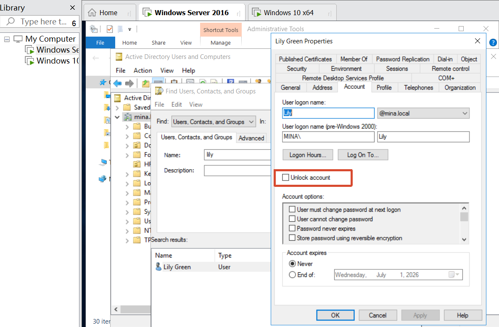

# * Setting Account lockout threshold

- Obejective:

  Making the account locked out if the user tried the wrong password more than 3 times.

- In the server side, Run -> **gpmc.msc**

  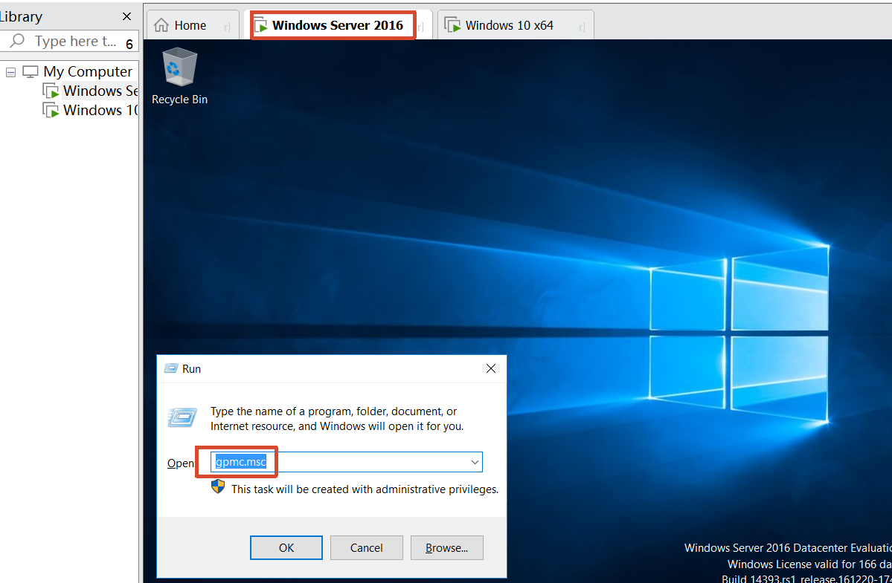

  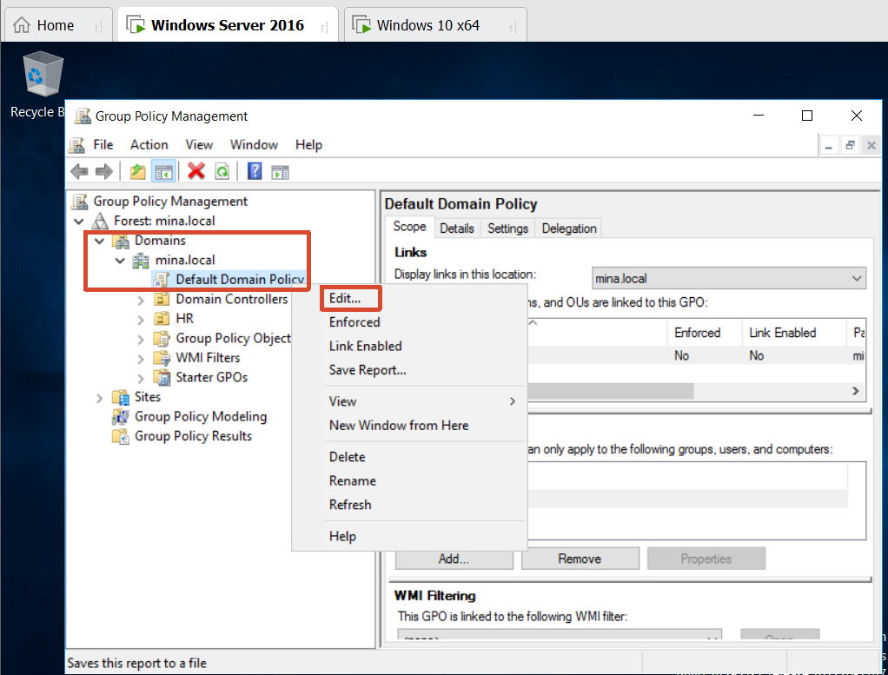

  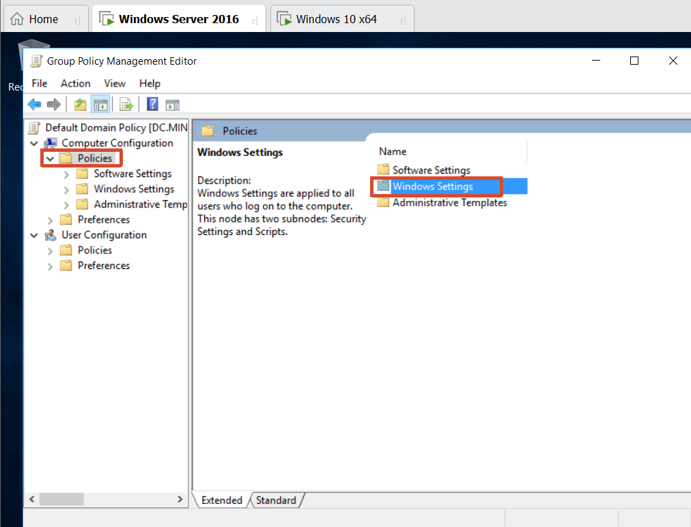

  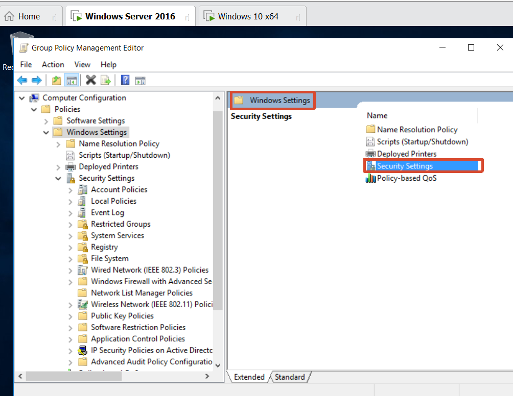

  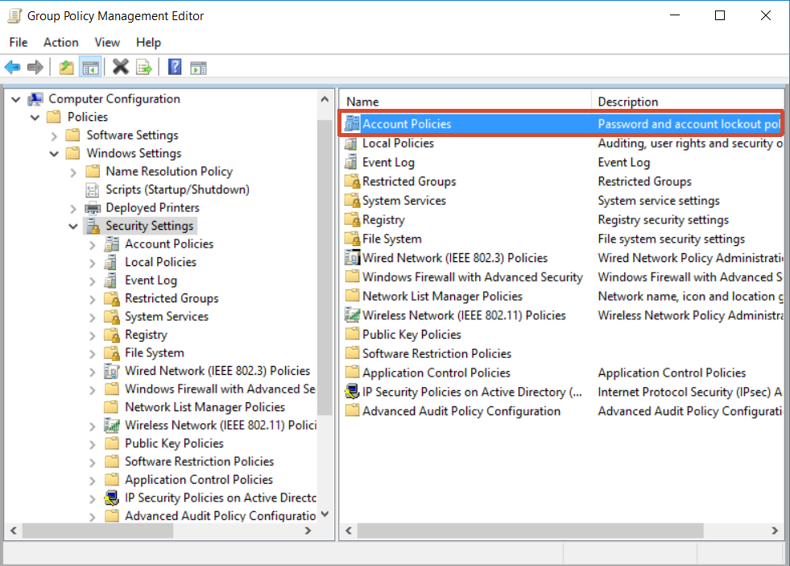

  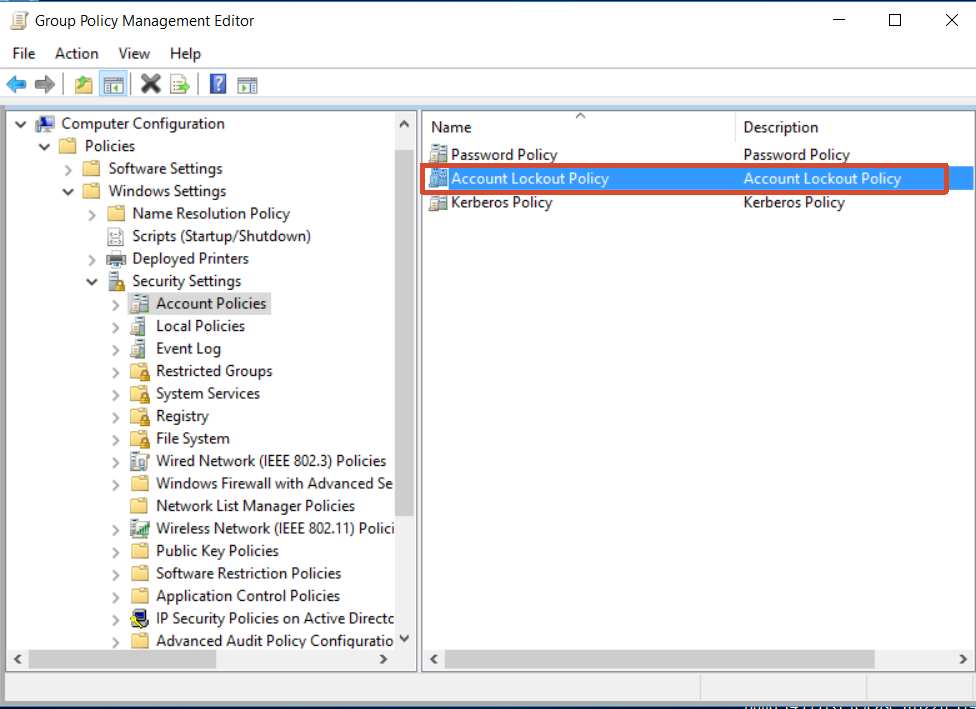

  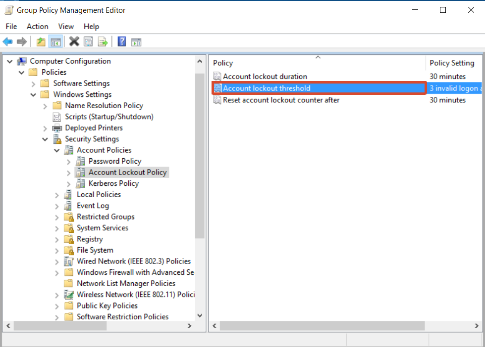

  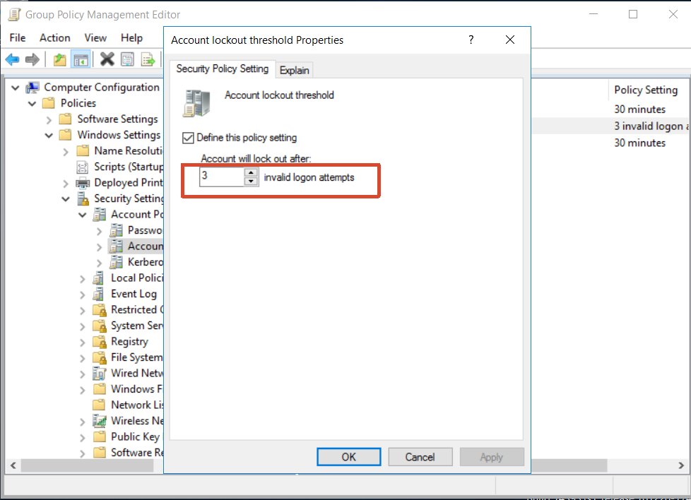

- cmd -> **gpupdate /force**

  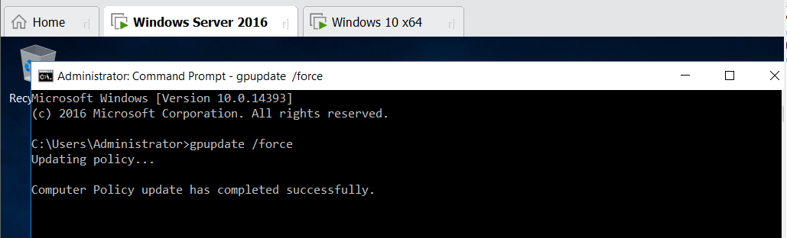
