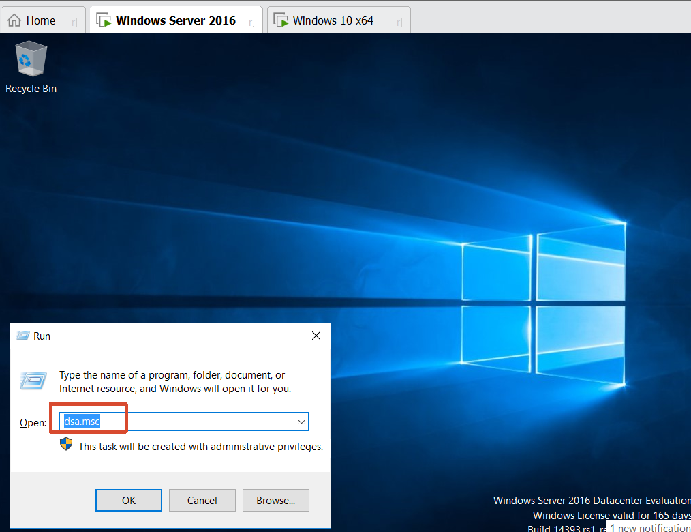
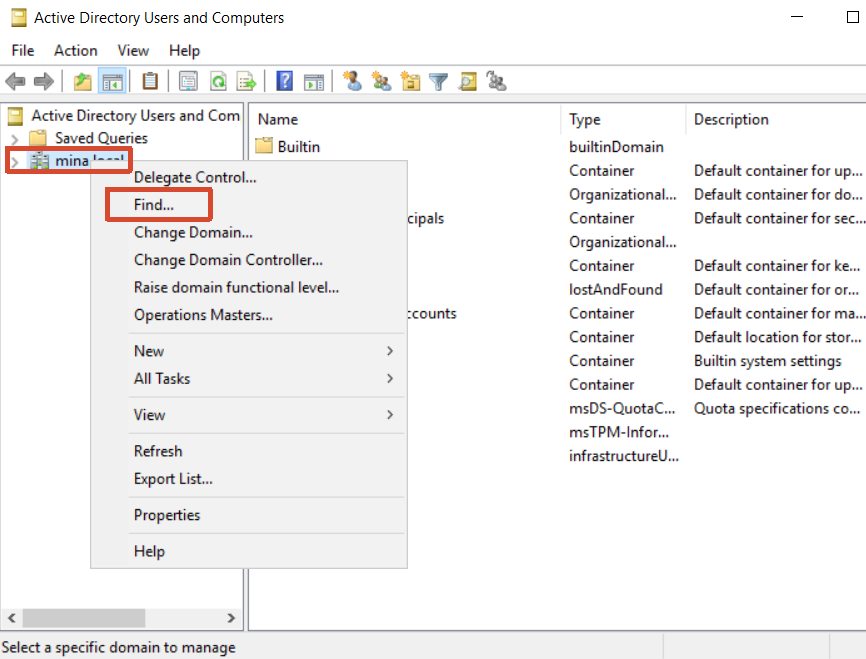
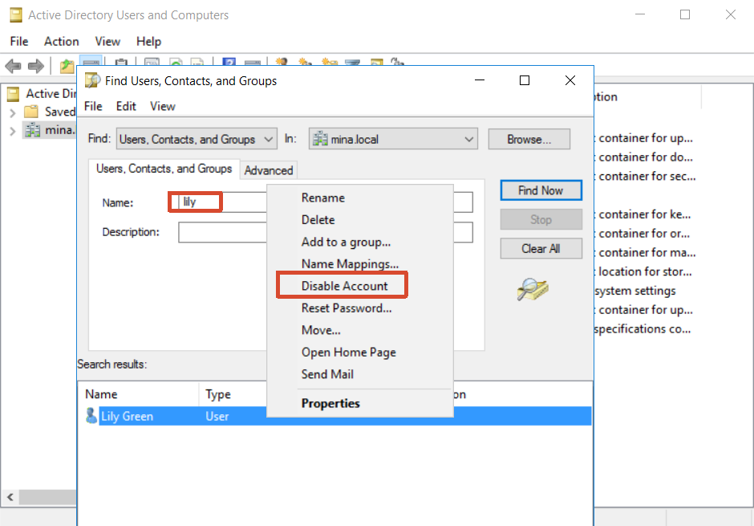
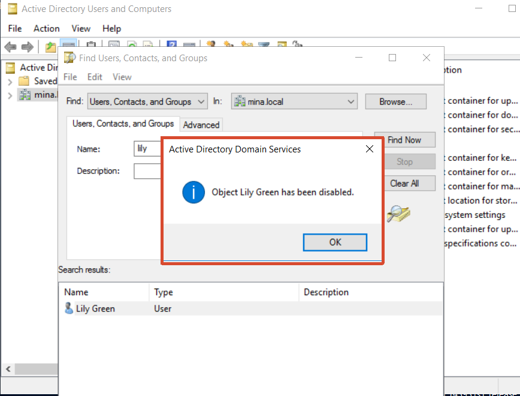
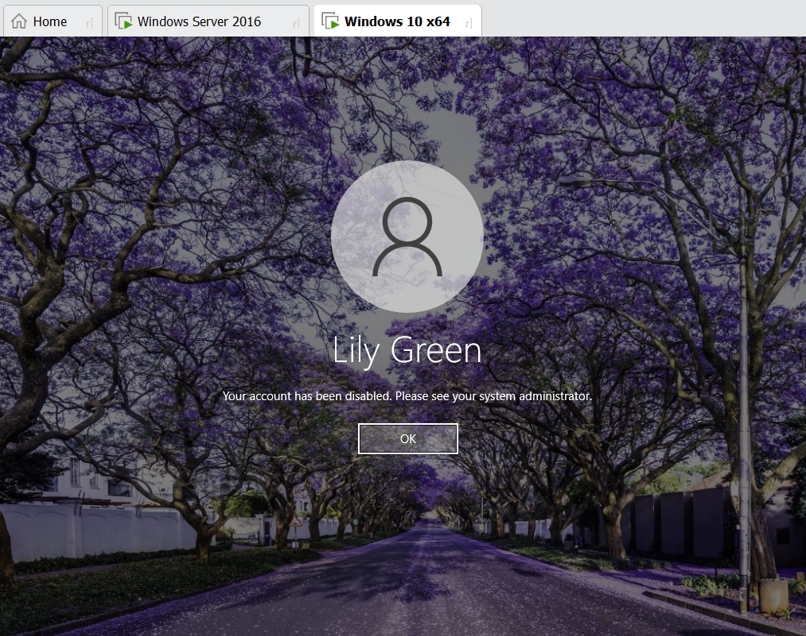
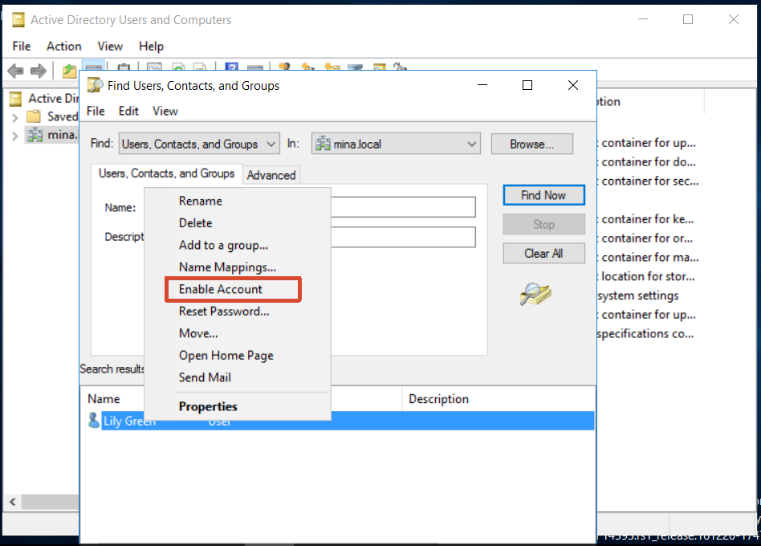
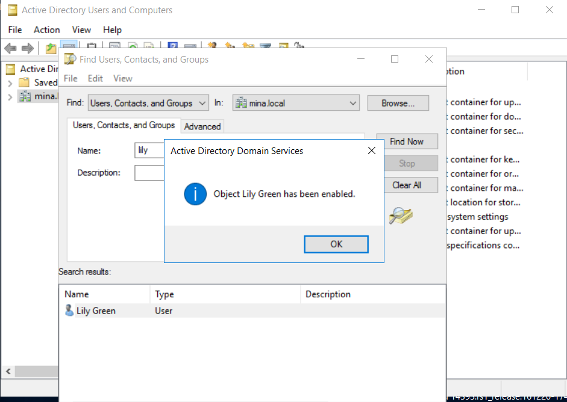

[toc]

# Obejective

- Connect to the server
- Create a user
- Log in 

# 1. Scenario

An employee has left the company (or is on extended leave).

As a best practice, the user account should be disabled rather than deleted. Disabling the account prevents unauthorized access while preserving ownership of files, folders, mailbox data, and permissions.

If the account is deleted, resources owned by that user may become difficult to manage. For example, shared folders or files may still reference the deleted account as the owner, making future permission changes or administration more complicated.

# 2. Action taken

## 2.1 Find the user

## 2.2 Disable the account

## 2.3 Enable the account

