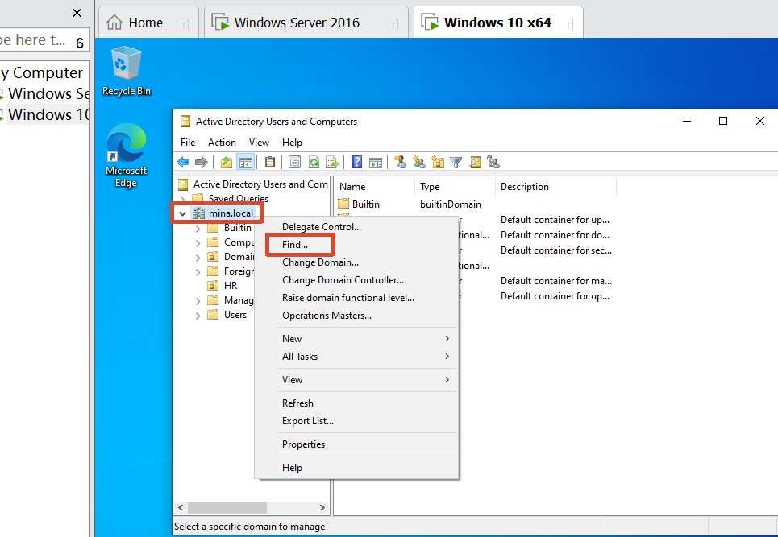
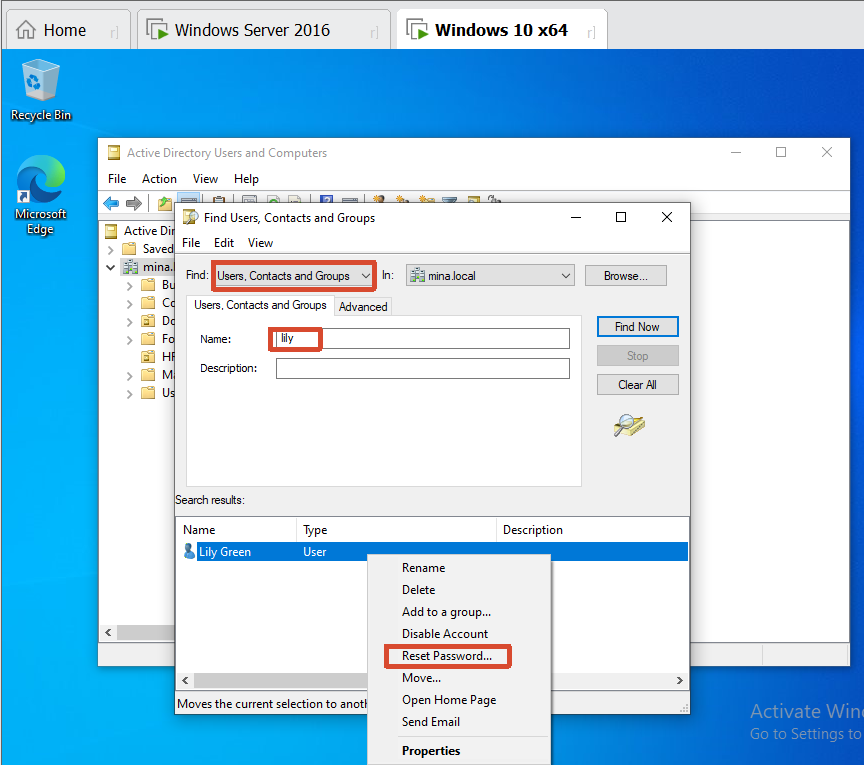
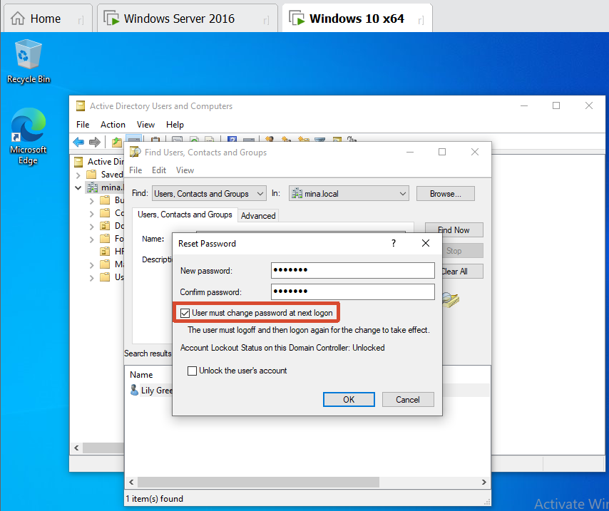

[toc]

# Obejective

- Verify the user
- Reset the password

# 1. Verify the user

- Check the user name
- Follow the company policy: for example confirm the user ID. Never give the password by phone.

# 2. Reset the password

- Find the user

  

- Reset the password

  

  
