[toc]

# 1. Scenario

A user can't join the domain.

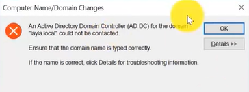

# 2. Action taken

## 2.1 Check the line cable

- Check the Ethernet cable not Wi-Fi

  - check the icon of Ethernet cable
  - or cmd -> ipconfig to check
  - or check the adaptor

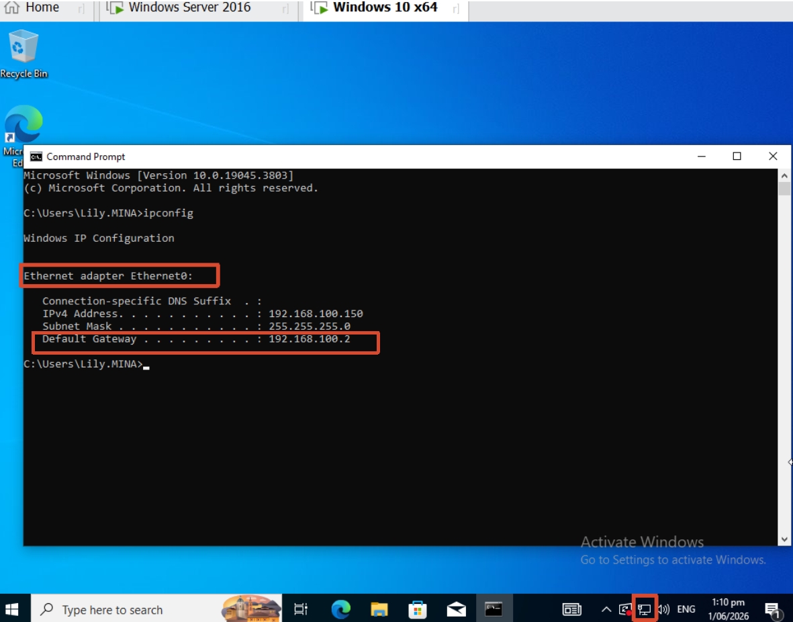

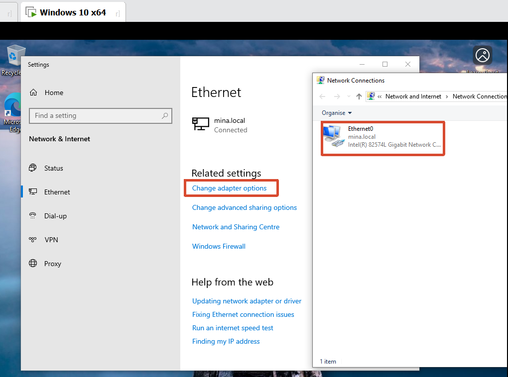

- Ping the server to check if the server is down.

  ```
  Ping mina.local
  ```

  It can connect to the server but the problem still exist, so it maybe the problem of the client side.

  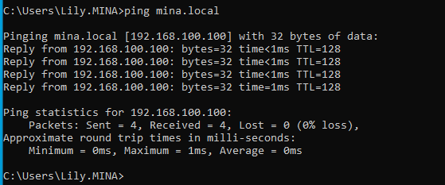


## 2.2 Delete the hostname from the AD

- Check the hostname of the client side

  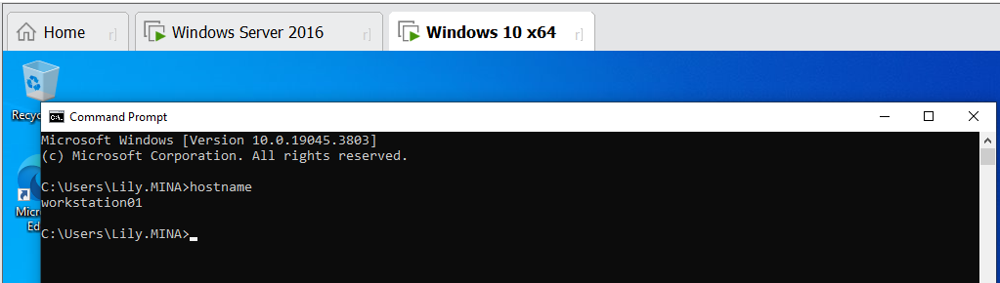

- Delete the hostname from the server side, then wait for 20-30min

  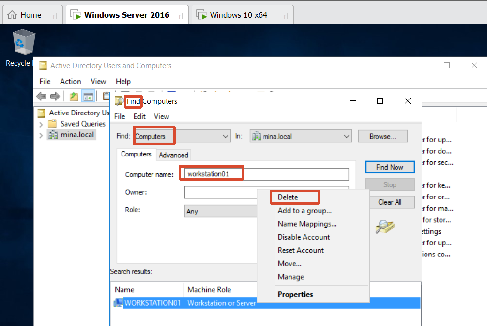

  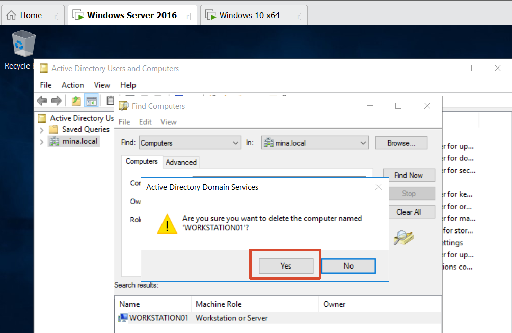


## 2.3 Join the domain again

Change the hostname and try to join the domain again

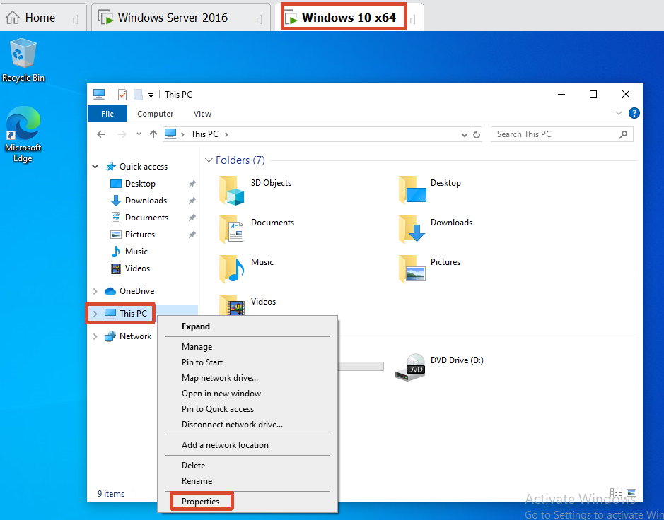

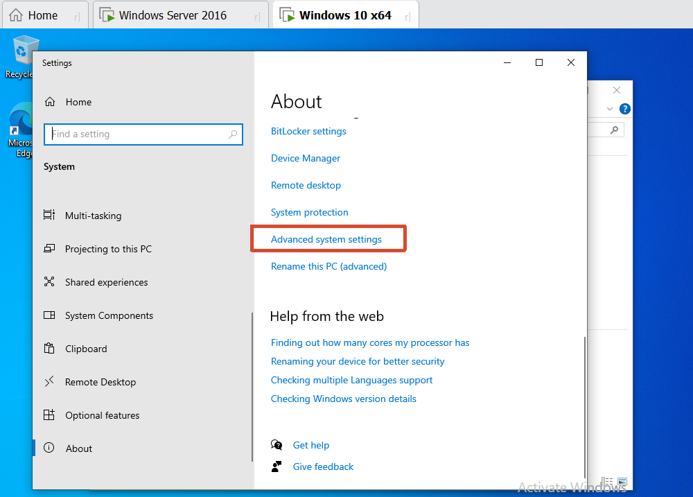

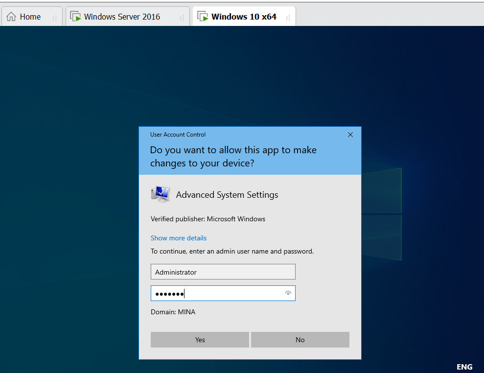

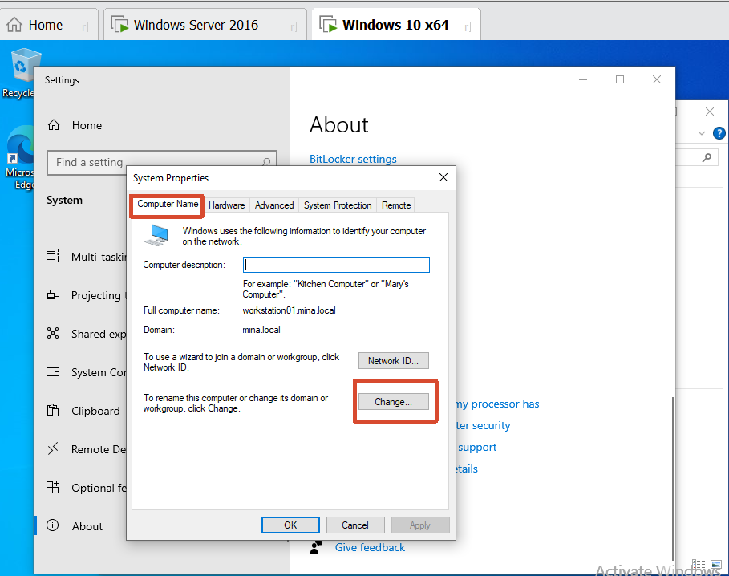

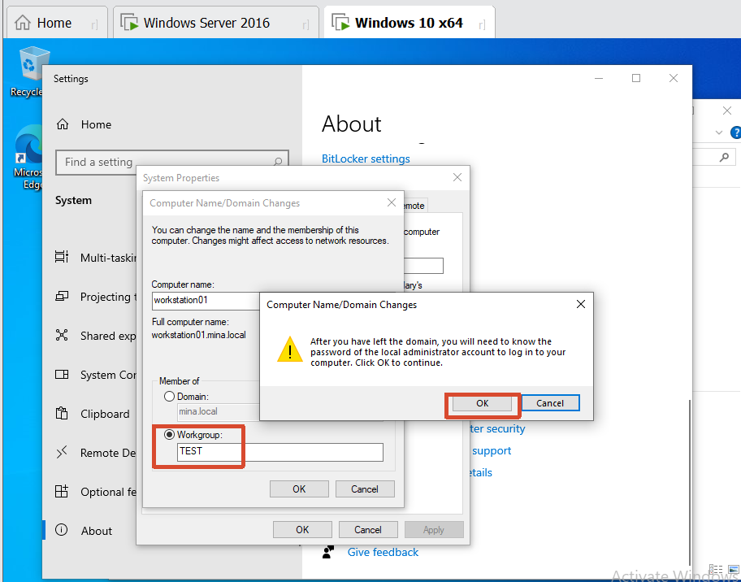

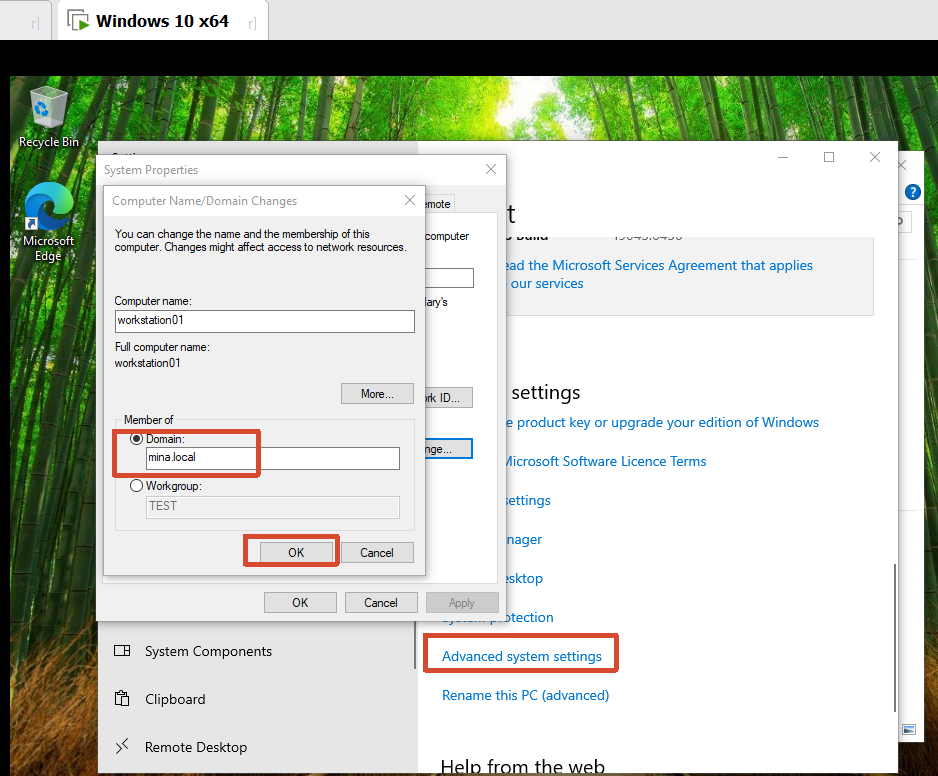

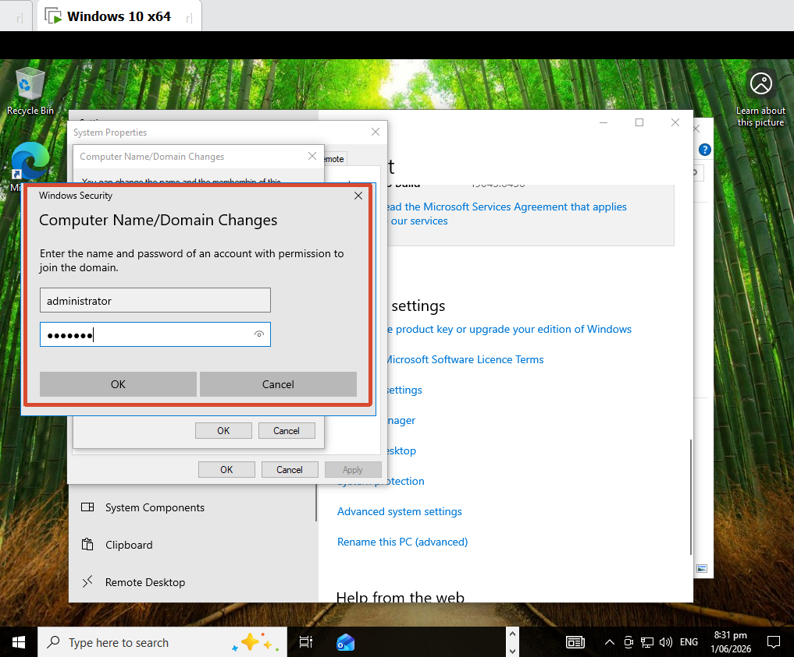


## 2.4 If all failed

Need to re-image the client machine and backup usere profile.
