[toc]

- Wifi icon: 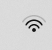

- Ethernet icon: 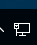


# 1. The Network is disabled

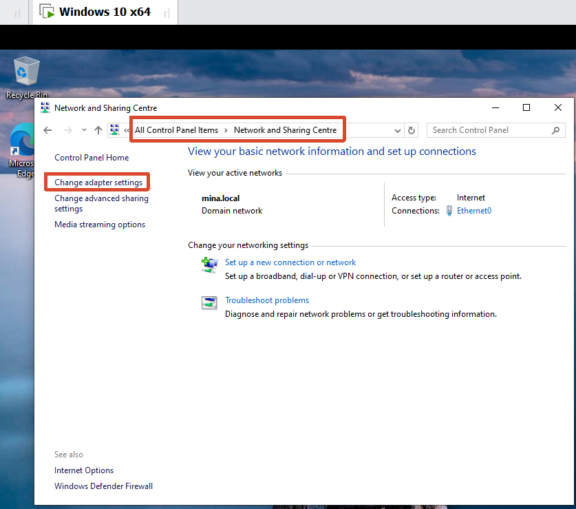

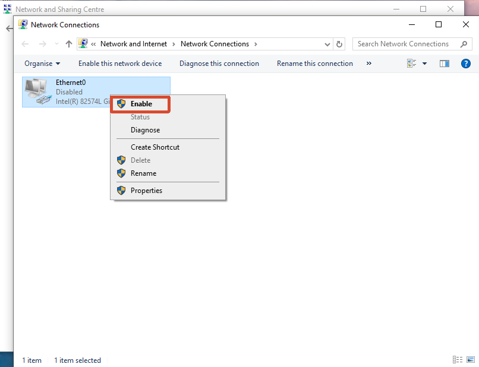

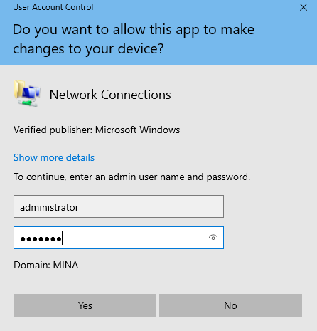


# 2. Can not see Network adapter

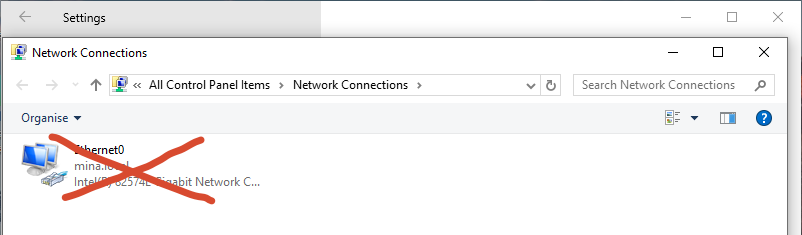

It means there is a driver issue. 

1. Check the adaptor of another laptop which is the same type with the issue one（If the laptop is connected by Ethernet then check the Ethernet adaptor, if it's connected by Wifi then check the wifi adaptor）.

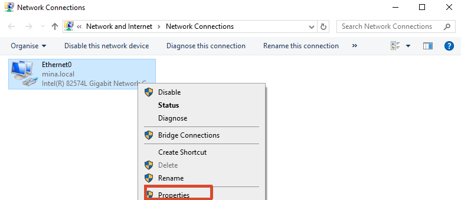

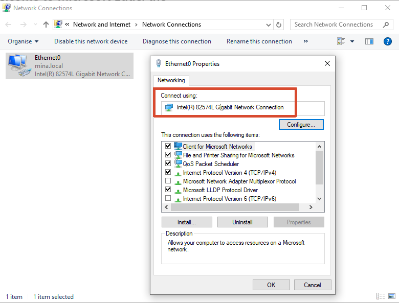

2. Then we google: download the driver, and install it.


# 3. Everything connected but cannot work

For example Lily works in China and she is on a business trip to NZ, she can't access the shared file in NZ. It may be affected by the AD policy, so we need to change her laptop to NZ and apply the policy of NZ.

1. Find the hostname of the client PC

   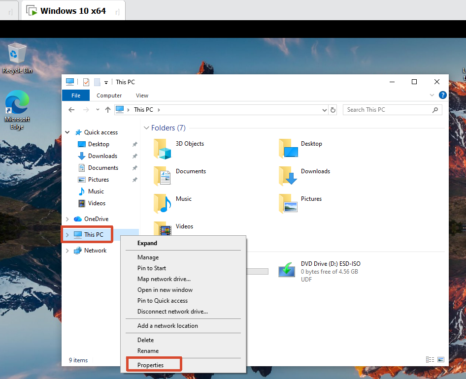

   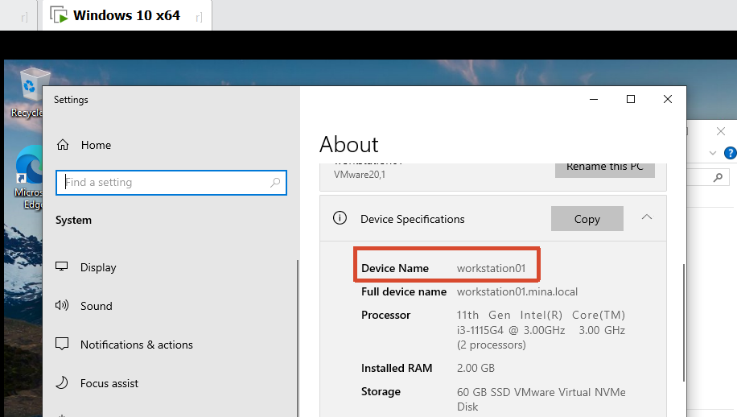

2. Go to the server side and find the PC

   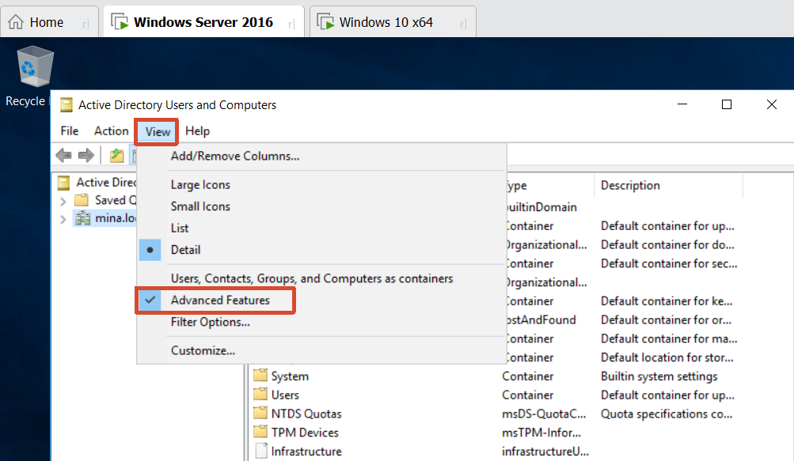

   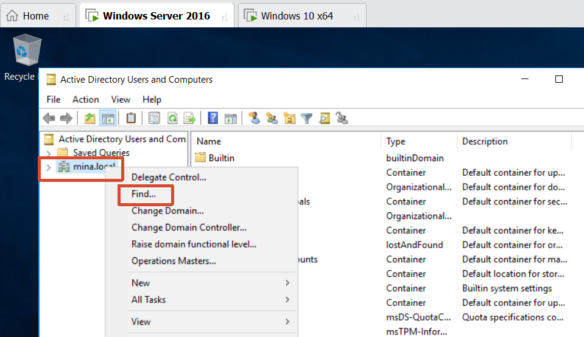

   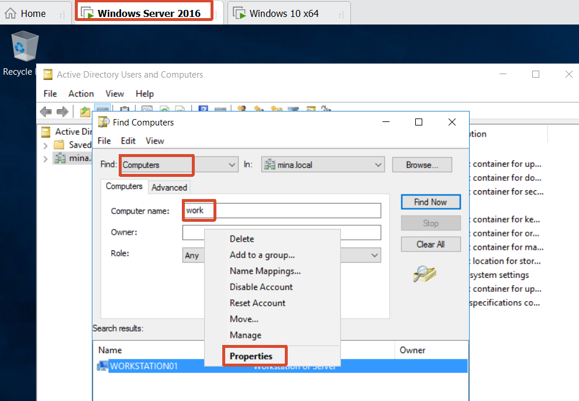

   we can see the full path of the PC, the PC is under China:

   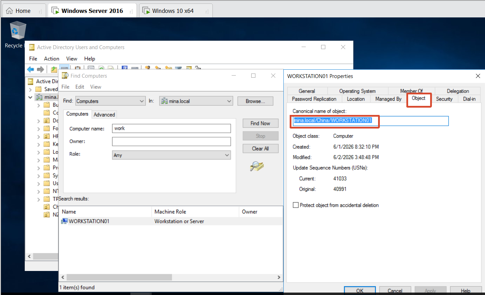

3. Move the PC from China to NZ:

   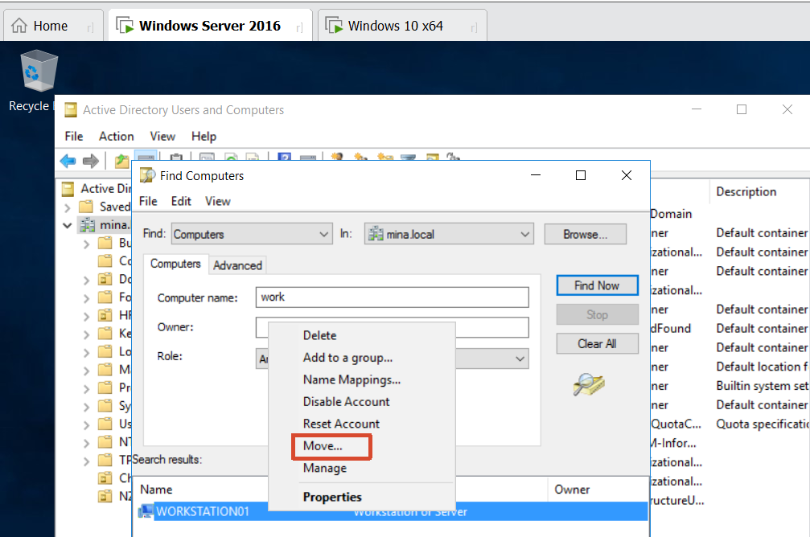

   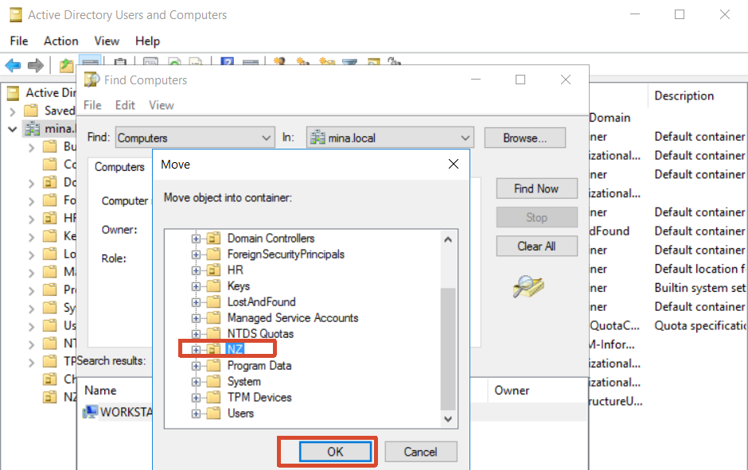

4. Go the client PC:

   ```
   gpupdate /force
   ```

   then restart the PC
